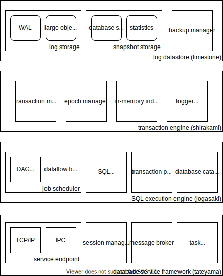

# Tsurugi DB アーキテクチャ図

## この文書について

* Tsurugi DB の OLTP 部分について、全体アーキテクチャを図示したもの

## アーキテクチャ図

## 解説

### database service framework

* 全体
  * データベースの各種コンポーネントをサービス化し、疎結合に連携させるためのフレームワーク
* service end-point
  * クライアントとサービスのやり取りを仲介するエンドポイント
  * 以下の接続形態がある
    * IPC - 共有メモリを利用した通信。高速に通信できるが、構成が限定される
    * TCP/IP - TCP/IP 通信を利用した通信。IPCに比べて低速・高遅延だが柔軟な構成が可能
  * 接続時には認証が必要になり、認証した結果はセッション情報の一部として保管される
* session manager
  * クライアントとデータベースの接続を表すセッションを管理するサービス
  * セッションは一定期間の通信が行われないと自動的に切断し、セッションに紐付けられたリソース (e.g. トランザクション) も解放される
* message broker
  * エンドポイントから送られてきたメッセージを宛先サービス (e.g. SQL実行エンジン) に届ける
  * メッセージの形式はサービスごとに規定され、ほとんどのサービスは protocol buffers を採用している
* task scheduler
  * 各サービスが非同期処理を行う際に利用するスレッドプール
  * オーバーヘッドを極小にするため、 non-preemptive + work stealing 方式であり、使い勝手はあまりよくない
* その他
  * 認証を行うためのサービスや、ユーザー定義サービスを登録するための拡張ポイントなども存在する

### SQL execution engine

* 全体
  * Tsurugi OLTP を SQL で操作するためのサービス
  * transaction engine と連携して、データベースの操作を担う
* job scheduler
  * SQL をジョブとして実行するためのコンポーネント
  * Tsurugi OLTP では SQL を各種 relational operator (の一部)を頂点とする directed acyclic graph (DAG) 形式のデータフローとして表現し、そのデータフローを並列処理することで SQL を実行している
  * 主に DAG executor と dataflow buffer manager からなり、前者は各頂点の実行順序の制御、後者は頂点間のデータの受け渡しを行う
* SQL compiler
  * SQL を解釈して DAG 形式に変換するコンポーネント
* transaction pool
  * transaction engine から発行された transaction を管理するプール
  * トランザクションでは複数の SQL ジョブを処理することがあり、ジョブをまたいでトランザクションを制御するために一時的に管理している
* database catalog cache
  * データベースメタデータを管理するキャッシュ
  * メタデータは上位のメタデータ管理基盤 (フロントエンドのPostgres内に配置) で管理しているが、SQL 実行エンジンでもスナップショットを保持している

### transaction engine

* 全体
  * データベース内に格納された実データの管理と、それを操作するためのトランザクション処理を制御するための機構
  * transaction engine 自体が key-value store (KVS) としてのインターフェースを有しており、同インターフェースを介してデータベースの操作を行う
  * 標準的には、 SQL execution engine を介して利用することになる
* transaction manager
  * 個々のトランザクションを管理するコンポーネント
  * すべての KVS への操作は必ずいずれかのトランザクション内で行われなければならず、そのトランザクションのライフサイクルを担う
* epoch manager
  * トランザクションの同期タイミングを制御する、エポックを管理するコンポーネント
  * Tsurugi OLTP の concurrency control はいくつかの制御をエポック駆動としており、エポックを一定時間で定期的に進めることで各種コンポーネント間の同期を行っている (e.g. ログへの書き出し)
* in-memory index
  * 現在のデータベースの内容を反映した索引データ
  * メモリ上に配置されており、データベースの終了とともに揮発する
* logging adapter
  * Tsurugi OLTP 上で行われたトランザクションの内容を永続化するためのコンポーネント
  * 実際の永続化は log datastore 内で行い、本コンポーネントは log datastore とのやり取りを担う

### log datastore

* 全体
  * Tsurugi OLTP 上で行われたトランザクションの内容を永続化するためのサービス
* log storage
  * トランザクションの処理内容を保存するストレージ
  * それぞれのトランザクション処理が完了したのちに即座に書き込まれ、データが失われないようにする
  * 書き込み性能を重視しているため、読み込みには適していない
* snapshot storage
  * WAL の内容を再編して読み込みに適したスナップショットを提供するストレージ
  * WAL への書き込み後、非同期的にスナップショットを構築するため、スナップショットの内容が常に最新とは限らない
    * データベース起動後には、強制的にWALの最新内容をスナップショットに反映させるため、 in-memory index に展開される際には最新のデータが利用できる
* backup manager
  * データベースの内容をバックアップするための機能を提供するコンポーネント
  * バックアップすべき内容のほとんどは log datastore サービス内に存在しており、 log/snapshot storage から適切なファイルをコピーすることで、バックアップが可能となっている
* その他
  * データベースレプリケーションを行う場合、本サービスを拡張して行うことになる
  * snapshot storage は、データベースが稼働中であってもスナップショットを提供可能 (開発中)
    * その際に提供されるスナップショットは、どのように読みだしてもデータベース全体で serializable になるようにデザインされている
    * ただし、最新より少し古いデータが提供されることになる

## その他のサービス

* 認証サービス
  * Tsurugi OLTP の外側に、セッション確立に必要な認証を行うサービスが存在する
* UDFサービス (開発中)
  * Tsurugi OLTP の UDF は基本的に Java などの一般的なプログラミング言語で記述する
  * SQL 実行エンジンは、別プロセスとして立てられた UDF サービスと通信し、UDF の評価を行う
* Embedded KVS サービス (開発中)
  * SQL 実行エンジンを介さずに、Tsurugi OLTP を直接 KVS として操作するための仕組み
  * サービスとしての実体はなく、 database service framework 内に SQL 実行エンジンの代替となる transaction engine を利用するサービスを自前で用意することになる
    * C++, preemptive scheduling, etc.
* フロントエンド
  * PostgreSQL を介して Tsurugi OLTP を操作するための機構
  * 他と同様、 database service framework を介して SQL 実行エンジンを利用する
