# Tsurugi OLTP サービスの構成について

2022-10-26 arakawa (NT)

## この文書について

* Tsurugi OLTP サービスがどのようなデータをどのように保持しているかを提示し、セキュリティの観点で構成上に不備がないか確認する
  * また、現状で保護対象外になっている項目について、Intel SGX などのプロセス隔離技術の適用可能性について検討を行うための情報を提供する
* なお、アプリケーションの脆弱性 (SQLインジェクションなど) の評価については、本文書の対象外とする

## セキュリティに関する基本的な考え方

* プロセス内の仮想メモリについては特別な保護を行わない
  * Linux のプロセス隔離に任せている
* データをファイルシステム上に保存する場合、暗号化可能にする
  * 暗号化はアプリケーション内で行う (暗号化ファイルシステムではなく、OLTP サービスが暗号化を施す)
  * ファイル全体を暗号化するのではなく、設定やレコード等の重要な部分に対してのみ行う場合がある
  * 性能の観点で、暗号化の有無を切り替えられるようにする (現時点では暗号化機能は未搭載)
* 暗号鍵情報の保全については未検討
  * 現時点では、 `~/.ssh/id_rsa` ファイルと同程度に考えている
* 各ファイルはLinuxのファイルパーミッションやACLによってアクセスを保護する
  * ただし、データベースログ等はバックアップを行う際に別プロセスから直接参照される場合がある
* プロセス間で共有する共有メモリについては、通常のファイルと同様に扱う
* TCP/IP 等のネットワークを利用する場合、TLS等の標準的な暗号化技術を利用する

## システム構成

* (1) Tsurugi OLTP クライアント - [tsubakuro](https://github.com/project-tsurugi/tsubakuro)
  * Java プロセスとして実行
  * 共有メモリまたはTCP/IP接続を利用し、Tsurugi OLTP サービスエンドポイントと通信
  * Tsurugi OLTP 利用者が任意の Java アプリケーションを構築
* (2) Tsurugi OLTP サービスエンドポイント - [tateyama](https://github.com/project-tsurugi/tateyama)
  * Tsurugi OLTP サービスプロセス内で実行
  * Tsurugi OLTP クライアントと相互に通信し、クライアントとSQL 実行エンジンとの間でコマンドやデータのやり取りを行う
* (3) SQL 実行エンジン - [jogasaki](https://github.com/project-tsurugi/jogasaki)
  * Tsurugi OLTP サービスプロセス内で実行
  * Tsurugi OLTP クライアントから渡されたSQLコマンドを解釈・実行する
  * データベース上のデータ操作は、トランザクションエンジンに依頼する (begin/commit/scan/get/put)
  * 基本的にはメモリ内で処理を行うが、メモリがあふれる場合にファイル上にデータを退避する場合がある
    * 内部的にはSQLを並列データフローに変換し、シャッフル操作やブロードキャストを多用するため、大容量メモリを必要とする
* (4) トランザクションエンジン - [shirakami](https://github.com/project-tsurugi/shirakami)
  * Tsurugi OLTP サービスプロセス内で実行
  * Key-Value Store として動作し、SQL 実行エンジンからデータの読み書きが行われる
  * 書き込まれたデータは、インメモリインデックスとログデータストアの両者に書き出す
  * データを読み込む際、ホット (新しい) データはインメモリインデックスを参照し、コールド (古い) データはログデータストアを参照する
* (5) インメモリインデックス - [yakushima](https://github.com/project-tsurugi/yakushima)
  * Tsurugi OLTP サービスプロセス内で実行
  * プロセスのメモリ上にテーブル領域、二次索引領域を確保し、そこに書き込まれたデータを保持する
    * 各テーブルや索引のキー列を Key-Value Store のKey、その他の列をValueとして保持する
      * TBD: 現状は mass-tree ベースであり、Trie 構造であり、Keyの暗号化は困難
  * Tsurugi OLTP サービスプロセスが終了するとデータは失われ、次回起動時にログデータストアから各種データを復元する必要がある
* (6) ログデータストア - [limestone](https://github.com/project-tsurugi/limestone)
  * Tsurugi OLTP サービスプロセス内で実行
  * バッファ、ログ、イメージの3種類からなり、バッファをプロセスのメモリ上に保持、ログとイメージをファイルとして保持する
    * 基本的には log-structured merge tree (LSM-tree) かそれに類する構成をとる
    * ログやイメージは一定のブロック単位で暗号化可能にする
  * BLOB などの large object をファイルとして保持する
    * これらはインメモリインデックス上には保持しない
  * 基本的には永続化処理が中心だが、以下のケースで読み込みが行われる
    * リストア操作時に、インメモリインデックスの内容を復元する
    * 一部のコールドデータを、インメモリインデックスではなくログデータストアから取得する
    * BLOB などの large object を取得する
* 備考
  * プロセスメモリにはもっと雑多なデータが格納されるが、データベース上のレコードに関連するもののみを記載している

## 制御とデータの流れ

### レコード追加

* フロー
  * (1) クライアントは、 `INSERT` 文をTsurugi OLTP サービスエンドポイントに送信する
  * (2) Tsurugi OLTPサービスエンドポイントは、 `INSERT` 文をSQL実行エンジンに引き渡す
  * (3) SQL実行エンジンは `INSERT` 文を解釈し、トランザクションエンジンにレコードを書き出す
  * (4) トランザクションエンジンは、受理したレコードをインメモリインデックスとログデータストアに書き出す
  * (5) インメモリインデックスは、受理したレコードをプロセスのメモリ上に保持する
  * (6) ログデータストアは、受理したレコードをログとバッファに書き出す
    * (6') さらに、必要であればバッファの内容をイメージに書き出す
  * (7) SQL実行エンジンは `INSERT` 文の完了をクライアントに通知する
* 備考
  * 上記は、実際にはトランザクションコミットの処理が一部混ざっている

### レコード取得 (ホットデータ)

* フロー
  * (1) クライアントは、 `SELECT` 文をTsurugi OLTP サービスエンドポイントに送信する
  * (2) Tsurugi OLTPサービスエンドポイントは、 `SELECT` 文をSQL実行エンジンに引き渡す
  * (3) SQL実行エンジンは `SELECT` 文を解釈し、トランザクションエンジンからレコードを取得する
  * (4) トランザクションエンジンは、インメモリインデックスからレコードを取得する
  * (5) インメモリインデックスは、プロセスのメモリから当該レコードを抽出する
  * (6) SQL 実行エンジンは、取得したレコードを結果セットとしてクライアントに送付
  * (7) クライアントは、受理した結果セットから結果を抽出

### レコード取得 (コールドデータ)

* フロー (ホットデータとの差分のみ)
  * ...
  * (4) トランザクションエンジンは、ログデータストアからレコードを取得する
  * (5) ログデータストアは、イメージを構成するファイルから当該レコードを抽出する
  * ...
* 備考
  * ログデータストアにおいて、書き込まれたデータは即座にイメージに追加されないが、コールドデータのみを対象としているため、十分に時間が経過しイメージに追加されたもののみを取り扱うことになる
    * そうでない新しいレコードは、インメモリインデックス上に保持してあるのでそちらから取得する

### バックアップ

* フロー
  * (1) クライアントは、バックアップの開始をTsurugi OLTP サービスエンドポイントに送信する
  * (2) Tsurugi OLTPサービスエンドポイントは、バックアップの開始をログデータストアに通知する
  * (3) ログデータストアは、バックアップ対象に含まれるデータをログファイルまたはイメージファイルにフラッシュする
  * (4) ログデータストアは、バックアップ対象のファイル一覧をクライアントに通知する
  * (5) クライアントは、受理したファイル一覧を手元に複製する
  * (6) クライアントは、バックアップの完了をTsurugi OLTP サービスエンドポイントに送信する (以下略)
* 備考
  * (5) の作業により、クライアントは、ログデータストアが作成するログファイルやイメージファイルを直接参照できる必要がある
  * クライアントは、バックアップ対象のファイルの中身を個別に参照することはない

### バックアップからのリストア

* フロー
  * (1) クライアントは、バックアップファイル一覧を Tsurugi OLTP サービスエンドポイントに送信する
  * (2) Tsurugi OLTPサービスエンドポイントは、バックアップファイル一覧をログデータストアに送付する
  * (3) ログデータストアは、バックアップファイル一覧からログファイルやイメージファイルを手元に複製する
  * (4) ログデータストアは、リストアの完了をクライアントに通知する
* 備考
  * (1) において、リストア操作を行う際、Tsurugi OLTP サービスは「メンテナンスモード」という特殊な状態で起動している必要がある
    * メンテナンスモードでは、SQL の実行などの機能は利用できず、データベースの診断やリカバリ・リストア操作などのメンテナンス機能のみを利用できる
    * 実際には、本項の「クライアント」は、Java プロセスではなく単なる Linux コマンドとして提供している
      * サービス停止状態からメンテナンスモードで起動し、(1)-(4) の操作を行った後、サービスを終了する
  * (3) の作業により、ログデータストアは、クライアントのバックアップファイルを直接参照できる必要がある

### インデックスのリストア

* フロー
  * (1) クライアントは、Tsurugi OLTP サービスを起動する
  * (2) トランザクションエンジンは、ログデータストアとインメモリインデックスをそれぞれ初期化する
  * (2) ログデータストアは、データベースイメージに未反映のログがあれば、反映する (recovery)
  * (3) インメモリインデックスは、ログデータストアにスナップショットを要求する
  * (4) インメモリインデックスは、スナップショットからテーブルデータを抽出し、メモリ上に配置する (restore)
  * (5) トランザクションエンジンが利用可能状態になる
* 備考
  * 実際には、本項の「クライアント」は、Java プロセスではなく単なる Linux コマンドとして提供している

### 補足: 認証

* 構成
  * トークン発行サービスは、Tsurugi OLTP サービスプロセスとは別の独立したプロセスとして動作
  * 認証サービスは、LDAP や PostgreSQL などの認証機能を有する別のサービス
* フロー
  * (1) クライアントはユーザから指定された認証情報を利用し、トークン発行サービスに認証トークンの発行を依頼する
  * (2) トークン発行サービスは、ユーザから指定された認証情報を利用して認証サービスに問い合わせ、認証情報の真正性を検証する
  * (3) トークン発行サービスは、認証情報の真正性を検証出来たら、認証トークン (JWT形式) をクライアントに払い出す
  * (4) クライアントは、トークン発行サービスから受理したトークンを、Tsurugi OLTP サービスに引き渡す
  * (5) Tsurugi OLTP サービスは、クライアントから受理したトークンをトークン発行サービスに渡し、妥当性を検証する
  * (6) Tsurugi OLTP サービスは、認証トークンが妥当であると判断されたら、ユーザを真正のものとして取り扱う
* 備考
  * 実際の運用では、(5) によって真正性が確認されたトークンを Tsurugi OLTP サービスが保持し続け、テーブルのアクセス可否などの認可情報の取得に利用する
    * これには、 PostgreSQL をメタデータ基盤とする Tsurugi データベース全体のアーキテクチャが必要となるため、今回は割愛した
  