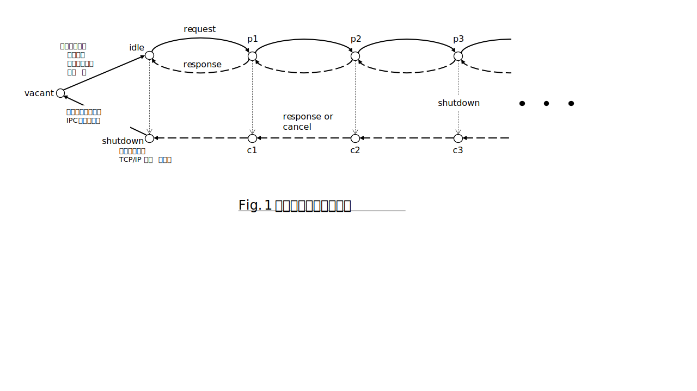
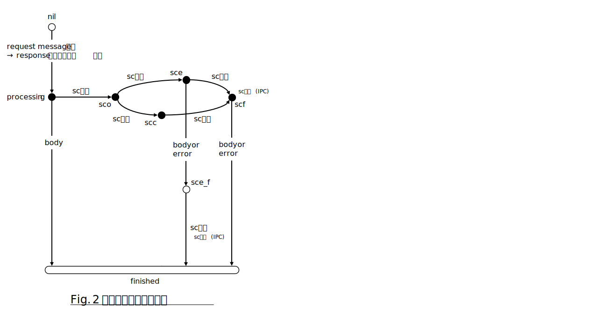

# endpointの状態遷移

* 2024-03-27 horikawa (NT)

## この文書について
この文書は、セッションやリクエストに関するリソースを解放するタイミングを、各々の状態遷移との関係で規定する。
その前提として、セッションやリクエストに関する状態遷移をキャンセル操作を含めて示す。
なお、本文書に記載した内容を理解するためには、endpoint動作の概略を理解していることが望ましい。

## セッションの状態遷移
### 前提
ここで規定するセッションの状態遷移は以下を前提とする。
* １セッションで複数のリクエストを同時に処理することが可能
* リクエストの処理はrequest messageの受信で開始し、response messageの送信で終了する。この際のresponse messageにはerrorを伝えるdiagnosticsを含む。
  * リクエストは、response message送信を以て完全に終了したものとする。
* セッションの終了操作はshutdown要求により行われる。shutdown要求はgracefulとforcefulの２種類。
  * clientからshutdown要求が行われていない状態での通信路切断は、forceful shutdown要求とみなす。

### リソース
セッション開設時に割り当て、閉塞時に解放するリソースは以下。
* スレッド：セッションに対応するworkerスレッド。
* オブジェクト：セッションに関する各種情報を格納するメモリ領域。
* 通信路：クライアントとの間でデータを受け渡す媒体。IPCの場合は共有メモリ、TCP/IPの場合はTCP/IP接続（socket）。

### 状態と遷移
セッションの状態は、そのセッションで処理しているリクエストの数と受け付けたshutdown要求で規定される。
* vacant：当該セッションをまだ開設していない。
* idle：処理中のリクエストはなく、shutdown要求も受け付けていない状態。
* p1, p2, ..., pn：n個のリクエストを処理中であり、shutdown要求を受け付けていない状態。
* c1, c2, ..., cn：n個のリクエストを処理中であり、graceful または forceful shutdown要求を受け付けた状態。
* shutdown：shutdownが完了した状態。
memo: TCP/IP通信路の場合、shutdown状態に移行する際に通信路は切断される。このため、クライアントからの以降のrequest message送信操作はエラーとなる。

セッション状態とその遷移をFig.1に示す。

各状態において遷移イベントを受け付けたときの動作は以下の通り。
* vacant
  * セッション接続要求を受け、idleに遷移。
  * この遷移により、セッションに関するリソース（スレッド、オブジェクト、通信路）を作成する。
* idle
  * request message受信により、p1に遷移。
  * graceful shutdown, forceful shutdownによりshutdownに遷移。
* pn
  * request message受信により、p(n+1)に遷移。
  * response message送信により、p(n-1)に遷移。nが1のときはidleに遷移。
  * graceful shutdownによりcnに遷移。
  * forceful shutdownにより。処理中の全リクエストに対してresponseオブジェクトを通じて処理要求キャンセルを処理モジュールに通知したうえでcnに遷移。
* cn
  * request message受信では状態は遷移させない。このとき、受信したリクエストには「セッション終了」をerrorとして通知する。
  * response message送信により、c(n-1)に遷移。nが1のときはshutdownに遷移。

### リソースの解放
セッションに関するリソースは以下のタイミングで解放する。
* スレッド：shutdown状態への遷移時。
* オブジェクト：vacant状態への遷移時。
* 通信路：IPC通信路はvacant状態への遷移時、TCP/IP通信路はshutdown状態への遷移時。
impl. memo: vacant状態への遷移はlistenerスレッドにより、garbage collectionと同様の遅延操作として行う。

## リクエストの状態遷移
セッションの安全な終了を実現するためには、セッションが処理するリクエストの完全な終了が可能という前提が必要となる。このため、セッション内部の詳細情報としてリクエストの状態遷移を示す。

### 前提
セッションの項で示した以外のリクエストに関する前提は以下の通り。
* リクエストの中には、サブチャネル（以下、scと表記）により処理結果をクライアントに転送するものがある。本項では、scに対する処理コンポーネントからのデータ送信完了はsc閉塞、クライアントによるscからのデータ受け取り完了は「sc完了」と表記する。
* 終了しているリクエスト（「セッションの状態遷移、前提」参照）に対するキャンセル要求は無効となる。

また、処理モジュールに以下の制約を設ける。
* キャンセル要求の有無にかかわらず、処理結果（キャンセル要求に対するキャンセル成功を含む）をbodyまたはerror経由でクライアントに伝えるのは処理モジュールの責務。
* クライアントに対する処理結果の（bodyまたはerror経由での）伝達が完了すれば、以降、クライアントへの通信は行わない。
* 処理モジュールによるbodyやerror(canceled含む)の呼び出しは、acquire_channel未実施またはacquire_channelされたchannelがrelease_channelされた状態でのみ行う。

### リソース
リクエストに関するリソースは以下。
* request, responseオブジェクト：request message受信により、当該リクエストを処理するためにendpointが作成するオブジェクト。
* data channel：処理結果をscによりクライアントに転送する場合、処理コンポーネントによるresponse::acquire_channel() API呼び出しを受けて作成する通信路。

### 状態遷移図
状態遷移図をFig.2に示す。

#### 各状態の説明
以下に各状態の説明を記す。
* nil：当該リクエストのrequest messageをまだ受け取っていない状態。
* processing：当該リクエストの処理を行っている状態。
* sco：当該リクエストの処理を行っている状態において、処理コンポーネントによsc開設要求を受け付けた状態。
* sce：sco状態において、処理コンポーネントからのsc経由のデータ送信が完了した状態。
* scc：sco状態において、クライアントがscからのデータ受け取りを完了した状態。
* scf：sco状態において、「処理コンポーネントからのsc経由のデータ送信完了」と「クライアントによるscからのデータ受け取り完了」の両イベントを経過した状態。
* sce_f：scc状態において、bodyまたはerrorによりresponse messageをクライアントに返した状態
* finished：当該リクエストの処理を終了した状態

#### 状態遷移の契機となるイベント
通常動作では、以下のイベントによりリクエストの状態が遷移する。

* response作成：clientからのリクエストメッセージを受信し、responseオブジェクトを作成した。
* サブチャネル（SC）開設：responseオブジェクトのacquire_channel()がcallされ、clientにデータを渡すchannelオブジェクトを作成した。
* サブチャネル（SC）閉塞：responseオブジェクトのrelease_channel()がcallされ、clientにデータ転送終了を伝えた。
* サブチャネル（SC）完了：clientから、SCから送られるデータの受け取り終了を通知された。なお、SC完了はSC閉塞の前、すなわちclientがSC経由で送られる全データを受け取る前に通知されることもある。
* 処理結果通知：responseオブジェクトのbody()またはerror()がcallされ、clientにresponse messageが伝えられた。

#### 各状態の定義とイベントによる遷移
各状態の定義を下表に示す。

| 状態名 | responseの 参照カウント | 処理結果通知 | channelの 参照カウント | sc閉塞 | SC完了 | 遷移先（イベント） | 補足 |
| :---: | :---: | :---: | :---: | :---: | :---: | :---: | :---: |
| nil | N.A. | N.A. | N.A. | N.A. | N.A. | processing（response作成）
| processing | 1以上 | 未 | N.A. | N.A. | N.A. | finished（処理結果通知） sco（sc開設）
| sco | 1以上 | 未 | 1以上 | 未 | 未 | sce（sc閉塞） scc（sc完了）
| sce | 1以上 | 未 | 1以上 | 完 | 未 | scf（sc完了） sce_f（処理結果通知） | channelは sc完了まで残す
| scc | 1以上 | 未 | 1以上 | 未 | 完 | scf（sc閉塞）
| scf | 1以上 | 未 | 0 | 完 | 完 | finished（処理結果通知）
| sce_f | 0 | 完 | 1以上 | 完 | 未 | finished（sc完了） | channelは sc完了まで残す
| finished | 0 | 完 | 0 | N.A. or 完 | N.A. or 完 | なし

ここで、N.A.は「当該オブジェクトが作成されていないため定義されない」の意。閉塞したscについてクライアントからsc完了通知を受け取っていない状態（sce, sce_f）のscは、clientによるデータ受け取りが完了するまで残しておく必要があるため、管理をresponseオブジェクトからセッションに移し、sc完了を通知された後にgarbage collectionにより消去する。このようなセッションが管理するscが残存している場合、それらに対するsc完了を受け取るまではセッションを安全に切断することはできない。
なお、「responseの参照カウント」はendpoint以外のモジュールからの参照を意味しており、endpointに属するオブジェクトからの参照は含めない。

### リソースの解放
リクエストに関するリソースは以下のタイミングで解放する。
* requestオブジェクト：endpointでは解放せず、リクエストを処理するコンポーネントに解放を委ねる。
* responseオブジェクト：処理モジュールからクライアントに対するbodyまたはerror経由での処理結果伝達が完了した時点でendpointから解放する。処理モジュールではresponseオブジェクトへの参照を保持していても良いが、前提に示した通り、処理結果伝達完了以降は通信を行わないものとする。
* data channel：sc閉塞とsc完了の両イベントによる状態遷移を完了したとき（scfおよびsce_fからfinishedへの遷移時）に解放する。
impl. memo: IPCでは、sc未完了のサブチャネルに対応する通信路リソースはworkerオブジェクトで保持しておき、workerスレッドまたはlistenerスレッドがsc完了イベントを確認した後に破棄する。
TCP/IPでは、enspointがsc閉塞イベントを受け取った時点でdata channelに関連するリソースを廃棄する。

### キャンセル時の動作
リクエストに対してキャンセルが要求された場合は、responseオブジェクトの状態を変更し、そのcheck_chancelメソッドがtrueを戻すようにすることで処理モジュールにキャンセル要求があったことを通知する。
キャンセル要求に対して、処理を継続して処理結果をbody経由でクライアントに伝えるか、キャンセル成功をerror経由で伝えるのかの選択は処理モジュールに委ねる。但し、前提に示した通り、処理モジュールはキャンセル要求時であっても必ず処理結果をクライアントに伝達しなければならない。なお、キャンセル要求時においても「セッションの状態遷移、前提」に記した通り、リクエストは処理モジュールによる（bodyまたはerror経由の）response message送信を以て完全に終了したものとする。
impl. memo: 処理結果が伝達されていない状態でrequestとresponseを保持するstd::shared_ptrの参照カウンタが0になったことをendpointが検知した場合は、safety netとしてerrorによりエラー（UNKNOWN）をクライアントに通知する。但し、このsafety net発動は処理モジュールのバグを意味する。