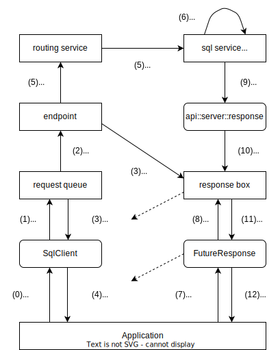
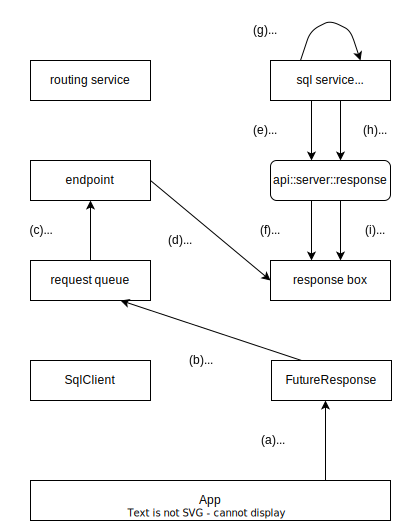
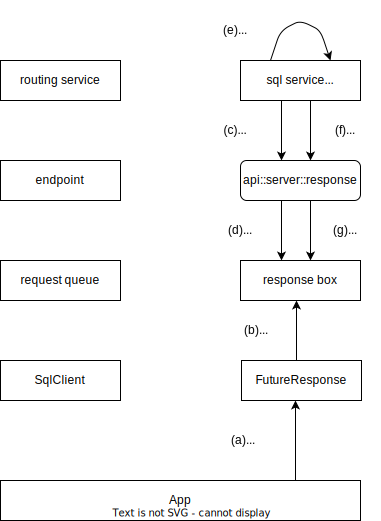

# ジョブのキャンセルに関するデザイン

* 2024-02-14 arakawa (NT)
  * 初版

## この文書について

* この文書は、Tsubakuro からジョブのキャンセルを行う際のデザイン案を示す
* この文書は、以下の内容を前提としている
  * [セッションをコントロールするCLIのデザイン]

[セッションをコントロールするCLIのデザイン]:https://github.com/project-tsurugi/tateyama/blob/master/docs/internal/session-control-design_ja.md

## コンセプト

* Tsubakuro の `FutureResponse` において、 `.get()` を行わずに `.close()` した際に、当該リクエストに対し「キャンセルを要求した」とみなす
  * リクエストのキャンセルは、 [セッションをコントロールするCLIのデザイン] にある forceful shutdown 時に発生するものと同等
    * キャンセルが要求されたリクエストは、速やかにその作業を終了し、抱えているリソースを開放する
    * キャンセルは必ずしも受理されるとは限らず、 point of no return を超えていた場合には、キャンセルの要求は無視されることになる
* キャンセルの要求は、概念的に「クライアントからレスポンスを無効化する」ことによって行う
  * クライアントがレスポンスを無効化すると、それはサーバ上に伝わり、当該ジョブは「レスポンスを用意する必要がなくなった」と判断して処理を終了することになる
  * クライアントはそれ以降、当該レスポンスをサーバから受け取らない (受け取っても無視する) ため、当該ジョブは本来のレスポンスを用意する必要はない
* `FutureResponse.close()` は、当該リクエストのキャンセルを待ち合せず、即座に終了する
  * `close()` メソッドは可能な限り素早く完了することが望ましいため
  * 同様に、キャンセルに失敗しても例外を発生させない
  * TBD: 別途 `FutureResponse.cancel(bool waitForComplete)` のようなものを用意してもいい
    * `Session.shutdown()` でキャンセルの待ち合わせは行えるし、ジョブのキャンセルを行った時点で正常でないと判断し、現状では必須と考えていない

## デザイン

### リクエスト・レスポンスの概念モデル

トランスポート層を抽象化したリクエスト・レスポンスの概念モデルは以下の通り。



* (0) アプリケーションはクライアント (e.g. `SqlClient`) のメソッドを呼び出す
* (1) クライアントはリクエストキューにリクエストを送付する
* (2) endpoint はリクエストキューからリクエストを取り出す
* (3) endpoint は response box を作成し、リクエストと関連付けてクライアントに通知する
* (4) アプリケーションは `FutureResponse` としてジョブの将来の結果を受け取る
* (5) endpoint はリクエストをルーティングサービス経由で各サービス (e.g. sql service) に通知する
* (6) サービスはリクエストを解釈し、ジョブを実行する
* (7) アプリケーションは `FutureResponse` にジョブの結果を要求する (`FutureResponse.get()`)
* (8) `FutureResponse` は response box からジョブの結果を待ち合わせる
* (9) サービスはジョブの結果を `response` オブジェクトに通知する (`response::body()`)
* (10) `response` オブジェクトはジョブの結果を、リクエストに関連付けられた response box に書き込む
* (11) `FutureResponse` は response box からジョブの結果を読み出す
* (12) アプリケーションは `FutureResponse` からジョブの結果を取得する

### キャンセルのフロー

キャンセルはキャンセルメッセージを独立したリクエストとして送り、キャンセル対象のジョブは、キャンセルが送られたことを確認したのち、自身の処理をキャンセルするようにする。



* (a) アプリケーションは `FutureResponse` を破棄する (`FutureResponse.close()`)
* (b) `FutureResponse` はリクエストキューにキャンセルの要求を送付する
  * この時、送り先のサービスは endpoint とする
  * このようなリクエストはスペシャルメッセージとして、routing service を経由しないで特別に取り扱うことになる (endpoint ごとの実装依存)
* (c) endpoint はリクエストキューからキャンセルリクエストを取り出す
* (d) endpoint は response box 上にキャンセルフラグを書き込む
* (e) サービスはジョブの実行中、定期的に `response` オブジェクトのキャンセルフラグを確認する ([`response::check_cancel()`](#response-オブジェクト))
* (f) `response` オブジェクトは、 response box からキャンセルフラグを読み出す
* (g) サービスはジョブのキャンセル処理を行う
* (h) サービスはジョブのキャンセルを行ったという結果を、 `response` オブジェクトに通知する ([`response::error()`](#response-オブジェクト))
* (i) `response` オブジェクトは、response box にキャンセルされたという結果を書き込む
  * しかし、この結果をクライアントは受け取らない

#### キャンセルのフロー (response box 経由)

>[!CAUTION]
> 実現が困難なため、廃案

キャンセルは response box を概念的に双方向化し、クライアントから response box 上にキャンセルフラグを立てることで実現する。



* (a) アプリケーションは `FutureResponse` を破棄する (`FutureResponse.close()`)
* (b) `FutureResponse` は response box にキャンセルの要求を書き込む
* (c) サービスはジョブの実行中、定期的に `response` オブジェクトのキャンセルフラグを確認する ([`response::check_cancel()`](#response-オブジェクト))
* (d) `response` オブジェクトは、 response box からキャンセルフラグを読み出す
* (e) サービスはジョブのキャンセル処理を行う
* (f) サービスはジョブのキャンセルを行ったという結果を、 `response` オブジェクトに通知する ([`response::error()`](#response-オブジェクト))
* (g) `response` オブジェクトは、response box にキャンセルされたという結果を書き込む
  * しかし、この結果をクライアントは受け取らない

## C++ API

### `response` オブジェクト

```cpp
class response {
public:
    // ...

    /**
     * @brief returns whether or not cancellation was requested to the corresponding job.
     * @details To cancel the job, first you must shutdown the operation of this job, and then call error().
     *    At this time, `OPERATION_CANCELED` is recommended as the diagnostic code for cancelling the job.
     *    Or, to avoid inappropriate conditions, you can omit the cancel request and complete the job.
     * @return true if the job is calling for a cancel
     * @return false otherwise
     * @see error()
     */
    virtual bool check_cancel() const = 0;

    /**
     * @brief report error with diagnostics information.
     * @param record the diagnostic record to report
     * @details report an error with diagnostics information for client. When this function is called, no more
     * body_head() or body() is expected to be called.
     * @attention this function is not thread-safe and should be called from single thread at a time.
     * @attention After calling this for cancelling the current job, the job must not use the related resources.
     *    This includes the below:
     * 
     *    - request object
     *    - response object
     *    - resources underlying session context
     */
    virtual void error(proto::diagnostics::Record const& record) = 0;

    // ...
};
```

* 備考
  * `check_cancel()` で状態を確認して、キャンセル状態であれば `error()` でジョブを終了する方針
    * `error()` で通知する診断コードは [`OPERATION_CANCELED`](#diagnosticscode) を指定するのがよい
    * doc comment にある通り、 `check_cancel()` でキャンセル状態であっても、無視してジョブを完遂してもよい
  * TBD: キャンセルだけ `error()` の事後条件が特別扱いであるが、要検討
    * キャンセルかどうかの判定は診断コードが `OPERATION_CANCELED` かどうかで判断する
    * やや複雑なので、 `error()` を一律に同じ挙動になるようにすべきか

## Protocol Buffers

### `diagnostics.Code`

既存の `tateyama::proto::diagnostics::Code` に定数を追加する。

```proto
// diagnostic code.
enum Code {
    // ...

    // operation was canceled by user or system.
    OPERATION_CANCELED = 42;

    // ...
}
```

* 備考
  * `OPERATION_CANCELED` は「キャンセルした際にクライアントに送付すべき診断コード」である
    * 現状では `OPERATION_CANCELED` は特別扱いされているので、キャンセル時には特別な理由がない限りそうすべきか

## Java API

* API レベルでは変更なし
* ただし、以下の挙動が規定される
  * `FutureResponse.close()`
    * 当該ジョブ未完了であれば、キャンセルする
  * `ResultSet.close()`
    * 関連しているジョブが未完了であれば、キャンセルする
