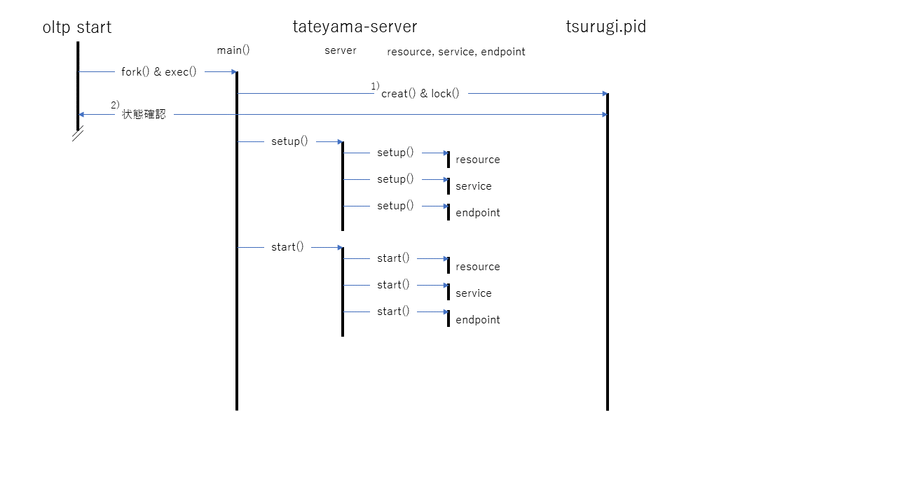
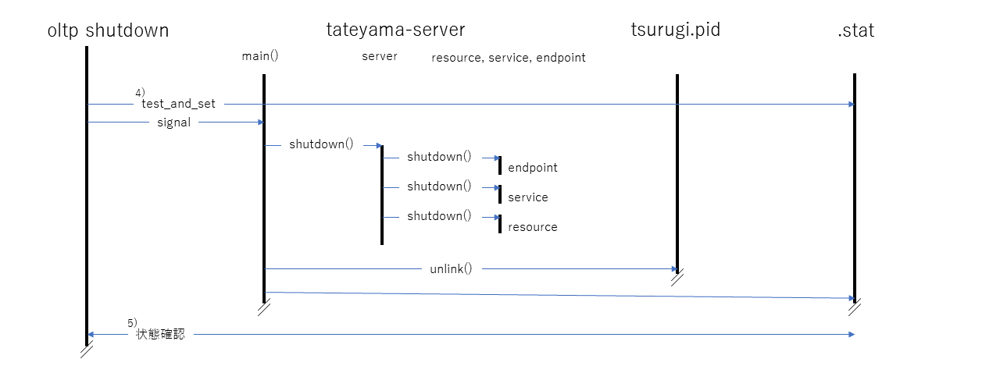
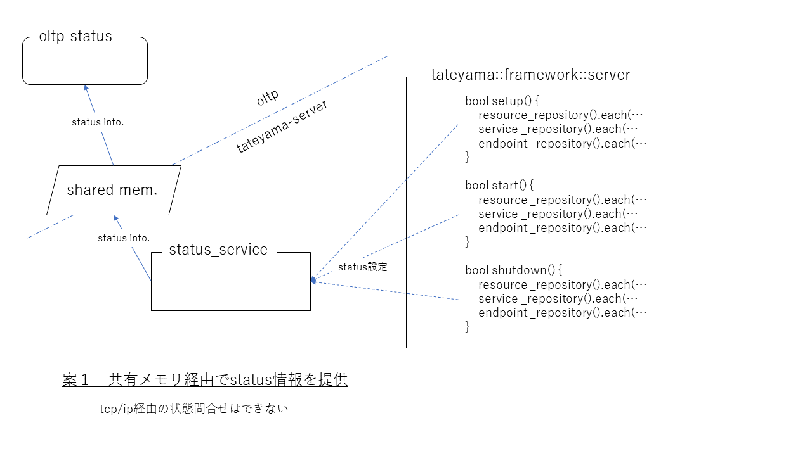
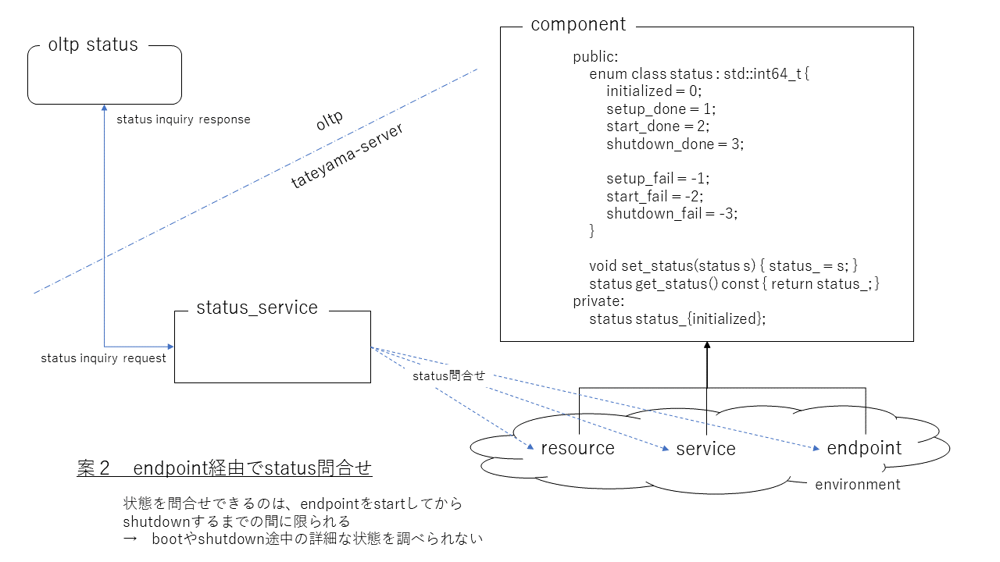

# status service設計方針

horikawa (2022-08-17)

## この文書について

tateyama内の各componentの状態を保持し、外部からの要求に応じて状態情報を提供するstatusサービスの設計方針を説明する。

## 方針

- status serviceは、[control_service](https://github.com/project-tsurugi/tateyama/blob/master/docs/tateyama-components-ja.md#:~:text=session_resource%20%3F-,control_service,-%E3%82%B5%E3%83%BC%E3%83%90%E3%83%BC%E3%82%92%E5%88%B6%E5%BE%A1)の一要素に位置づける。
- 各componentへの状態遷移要求（次節参照）の成功・失敗を状態情報に含める。

## 状態について
各componentのライフサイクルにおける段階を「componentの状態」と呼ぶ。具体的には、下記の段階がある。
- 初期状態
- setup完了状態
- start完了状態
- shutdown完了状態

上記状態間の遷移は、tateyama::framework::serverのsetup(), start(), shutdown()メソッドが各componentのsetup(), start(), shutdown()メソッドを呼び出すことにより行われる。 
         
1) tsurugi.pidファイルが既に存在している場合、tateyama-serverの以降の起動操作は行わず、エラー終了（別のサーバ起動）となる。
2) tsurugi.pidファイルに書き込まれたpidが、oltp startがfork()したpidと一致しない場合は、tateyama-server起動失敗（別のサーバ起動）となる。
3) `oltp start` コマンドは、状態格納用共有メモリに格納されたtateyama-serverがactivatedになったことをを確認して（正常）終了する。 
         
4) `oltp shutdown` コマンドは、状態格納用共有メモリのshutdownフラグに対してtest_and_setを行い、最初にshutdown操作を行うプロセスであることを確認する。
   既に別のshutdownが実行されている場合、shutdown操作を行わず、直ちにエラー終了（別のshutdown操作進行中）となる。
   また、状態格納用共有メモリが存在していない場合は、エラー終了（shutdown対象のtateyama-servetが起動していない）となる。
5) `oltp shutdown` コマンドは、状態格納用共有メモリの削除を確認して（正常）終了する。 

### 状態の種類
status serviceは、各componentの状態を以下に区分して扱う。
- 初期状態
- setup成功
- start成功
- shutdown成功
- setup失敗
- startup失敗
- shutdown失敗

## 状態格納と外部からの状態問い合わせ
各componentの状態は共有メモリに格納し、tateyama-server外部（`oltp status`コマンド等の「クライアント」）からアクセス可能とする。
         

endopointを経由してprotocol buffersにより問い合わせる方法では、「tateyama-server外部から状態を問合せできるのは、
endpointをstartしてからshutdownするまでの間に限られるため、bootやshutdown途中の詳細な状態を調べられない」という問題が大きいため、採用しない。
         
